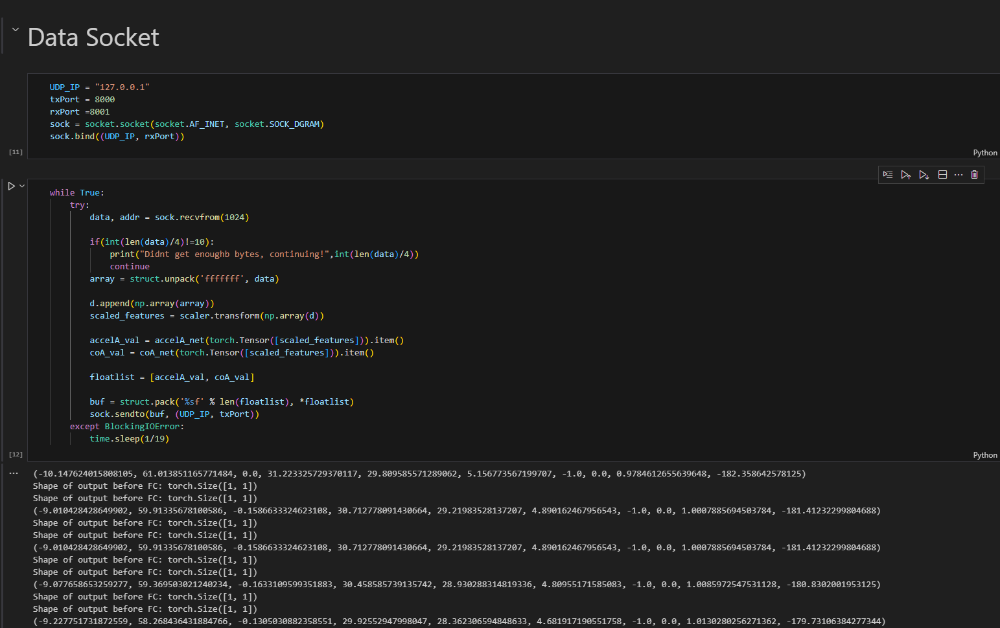

# Driver-AV Training

This project implements a machine learning model for autonomous vehicle that represents the behaviors from a specific dataset. The communication between the Python backend and the Unity frontend is handled via UDP.

## Backend for Deployment (Unity UDP Playback)
The `playback.ipynb` notebook serves as the backend for real-time inference and communication with a Unity client.

### How it Works
The notebook loads the pre-trained model and listens for incoming UDP packets from Unity about the current interation between driver and AV in the virtual environment. When a packet is received, the backend processes the data, runs it through the model for inference, and sends the results back to the Unity client over UDP.

### Usage
1.  **Run the Backend**: Open `playback.ipynb` and run all the cells to start the UDP server.
2.  **Start the Unity Scene**: Open your Unity project and run the scene that contains the UDP client script.
3.  **Real-time Playback**: The Unity application will now communicate with the Python backend, sending data and receiving model predictions for real-time playback and visualization.

### Configuration
* **IP Address**: `127.0.0.1` (localhost)
* **Port**: 5000 by default

Make sure these settings match in both the `playback.ipynb` notebook and your Unity client script.
